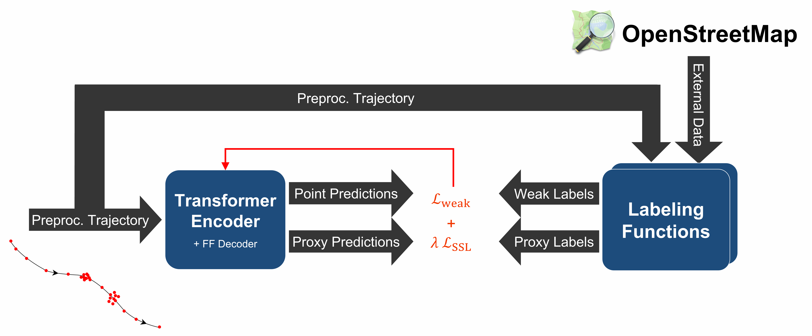

# DeepStay: Stay Region Extraction from Location Trajectories using Weak Supervision

The original code to Christian Löwens, Daniela Thyssens, Emma Andersson, Christina Jenkins, and Lars Schmidt-Thieme "DeepStay: Stay Region Extraction from Location Trajectories using Weak Supervision".



The preprint version can be found soon on arXiv.

## Requirements

This code was tested on CPU and GPU with the following environment:
- conda:
    - python=3.10.10
    - pytorch=2.0.1
    - numpy=1.24.3
    - pandas=1.5.3
    - tqdm=4.65.0
- conda-forge:
    - geopandas=0.13.0
- pip:
    - tensorboard=2.13.0
    - func_argparse=1.1.1
    - osmnx=1.3.0

## Experiment 1: SR Extraction
Our results can be reproduced with these four steps:
### 1) Datasets
The following commands download and annotate the GeoLife (GL) and ExtraSensory (ES) datasets:
```bash
python ./data/gl_preprocessing.py
python ./data/es_preprocessing.py
```

### 2) Pre-training
To pre-train DeepStay on the GL dataset, execute the following command:
```bash
python ./src/experiment.py --data="gl" --train_data_path="./data/tmp/preprocessed/gl.pkl"
```
To see all adjustable parameters, call:
```bash
python ./src/experiment.py --help
```
### 3) Fine-tuning
After pre-training, fine-tune DeepStay on the ES dataset:
```bash
python ./src/experiment.py --data="es" --interp_sec=2 --train_data_path="./data/tmp/preprocessed/es_kfold/0_train.pkl" --pretrained_model_path="./trained_models/<PRETRAINED-MODEL-FILENAME>" --no-use_trained_decoder
```

### 4) Evaluation & Baselines
Get the final model predictions for the `0_test.pkl` test set:
```bash
python ./src/evaluation.py get_model_prediction --data="es" --dataset_interp_sec=2 --testdata_filepath="./data/tmp/preprocessed/es_kfold/0_test.pkl" --model_path="./trained_models/<FINETUNED-MODEL-FILENAME>" --output_filepath="<OUTPUT_FILEPATH>"
```

For kfold evaluation of the baseline algorithms call:
```bash
python ./baselines/evaluation.py  --output_filepath="baseline_results.csv"
```

## Experiment 2: Transportation Mode Detection (TMD)
### 1) Dataset
Download the GL dataset as described in Experiment 1.

### 2) Training
```bash
python ./src/experiment.py --data="tm" --train_data_path="./data/tmp/preprocessed/gl.pkl" --val_frac=0 --test_k=0
```

### 3) Evaluation
Get the final model predictions:
```bash
python ./src/evaluation.py get_model_prediction --data="tm" --testdata_filepath="./data/tmp/preprocessed/gl.pkl" --model_path="./trained_models/<TMD-MODEL-FILENAME>" --output_filepath="<OUTPUT_FILEPATH>" --tm_test_k=0
```
